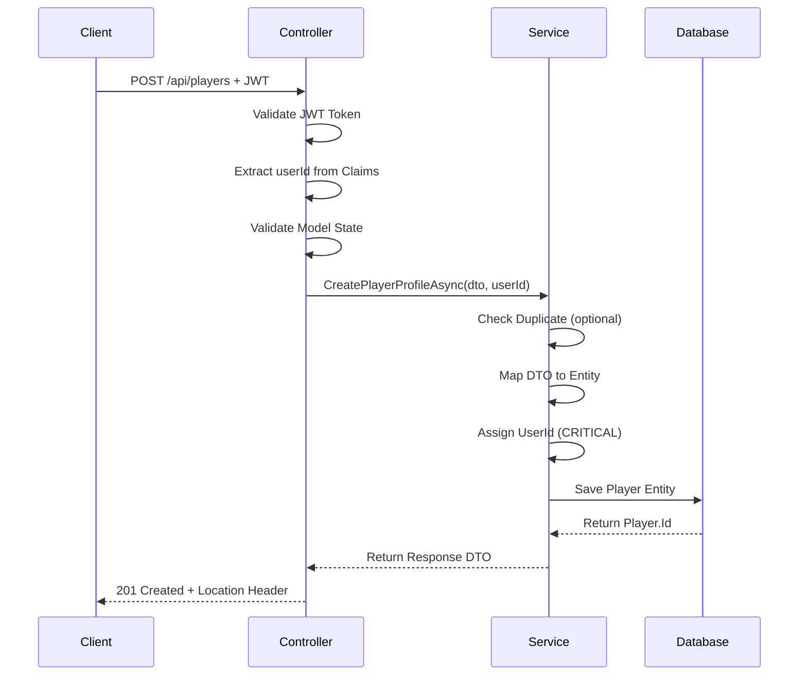

# ✅ User Self-Service Player Profile API - Implementation Complete

## 📋 Technical Specification

### Objective
Implement API endpoints that allow authenticated users to create their own player profiles for tournament participation. This ensures player data is always linked to the owner from the start, preventing orphaned data.

---

## 🎯 API Endpoints

### 1. Create Player Profile
**Endpoint:** `POST /api/players`

**Authentication:** Required (`[Authorize]` - Bearer Token)

**Request Body:**
```json
{
  "fullName": "Nguyễn Văn A",
  "nickname": "Ace",
  "email": "nguyenvana@example.com",
  "phone": "+84901234567",
  "country": "VN",
  "city": "Ho Chi Minh",
  "skillLevel": 7
}
```

**Response (201 Created):**
```json
{
  "playerId": 123,
  "fullName": "Nguyễn Văn A",
  "email": "nguyenvana@example.com",
  "message": "Player profile created successfully",
  "createdAt": "2025-11-21T10:30:00Z"
}
```

**Response Headers:**
```
Location: /api/players/123
```

### 2. Check Duplicate Profile
**Endpoint:** `GET /api/players/check-duplicate?fullName={name}`

**Authentication:** Required

**Query Parameters:**
- `fullName` (string, required): Name to check for duplicates

**Response (200 OK):**
```json
true  // or false
```

### 3. Get Player Profile
**Endpoint:** `GET /api/players/{playerId}`

**Authentication:** Required

**Response (200 OK):**
```json
{
  "message": "For full player details, use GET /api/admin/players/{id}",
  "playerId": 123
}
```

---

## 📊 Data Contract (DTO)

### CreatePlayerProfileDto (Input)

| Field | Type | Required | Validation | Notes |
|-------|------|----------|------------|-------|
| **FullName** | string | ✅ Yes | MaxLength(200) | Display name on brackets |
| **Nickname** | string | ❌ No | MaxLength(100) | Tournament alias |
| **Email** | string | ❌ No | EmailAddress | Can differ from login email |
| **Phone** | string | ❌ No | Phone | Contact for tournament |
| **Country** | string | ❌ No | MinLength(2), MaxLength(2) | **ISO 2-letter code only** (VN, US) |
| **City** | string | ❌ No | MaxLength(100) | For regional filtering |
| **SkillLevel** | int? | ❌ No | Range(0-100) | For seeding/handicap |

### System-Assigned Fields (Backend Only)

| Field | Source | Notes |
|-------|--------|-------|
| **UserId** | `ClaimTypes.NameIdentifier` from JWT | ⚠️ **CRITICAL:** Never trust client input |
| **CreatedAt** | `DateTime.UtcNow` | Automatic timestamp |
| **Id** | Database (Identity) | Auto-generated |

---

## 🔒 Security Implementation

### Authentication Flow
1. **Token Validation:** ASP.NET Core validates JWT Bearer token
2. **User Extraction:** Extract `userId` from `ClaimTypes.NameIdentifier`
3. **Ownership Assignment:** Automatically link player to authenticated user

### Critical Security Rules
```csharp
// ✅ CORRECT - Trust JWT claims
var userId = User.FindFirstValue(ClaimTypes.NameIdentifier);
newPlayer.UserId = userId;

// ❌ WRONG - Never do this
// var userId = dto.UserId; // Client can fake this!
```

---

## 🏗️ Implementation Architecture

### Files Created

1. **`Dtos/PlayerProfile/CreatePlayerProfileDto.cs`**
   - Input DTO with validation attributes
   - Response DTO with created player info

2. **`Services/IPlayerProfileService.cs`**
   - Service interface
   - Methods:
     - `CreatePlayerProfileAsync()`
     - `HasDuplicateProfileAsync()`

3. **`Services/PlayerProfileService.cs`**
   - Business logic implementation
   - Database operations
   - Duplicate detection

4. **`Controllers/PlayerProfileController.cs`**
   - REST API endpoints
   - Request/response handling
   - JWT claims extraction

5. **`Program.cs`** (Modified)
   - DI registration: `AddScoped<IPlayerProfileService, PlayerProfileService>()`

---

## 🔄 Implementation Flow



---

## ✅ Business Rules

### 1. Ownership Assignment
- **Player.UserId** is automatically set from JWT token
- User cannot create profiles for other users
- One user can create multiple profiles (allowed)

### 2. Duplicate Detection
- **Warning only** (not blocking)
- Case-insensitive name comparison
- Per-user scope (same user can have duplicate names)
- Useful for preventing accidental re-creation

### 3. Country Code
- **Must be ISO 2-letter format** (VN, US, JP, etc.)
- Frontend should use country picker with ISO codes
- Backend converts to uppercase for consistency

### 4. Data Trimming
- All string fields are trimmed before saving
- Empty strings converted to null
- Country code always uppercase

---

## 🧪 Testing Scenarios

### Positive Tests
- ✅ Create profile with all fields
- ✅ Create profile with minimal fields (only FullName)
- ✅ Create multiple profiles for same user
- ✅ Create with duplicate name (should warn but succeed)

### Negative Tests
- ❌ Create without authentication → 401 Unauthorized
- ❌ Create with invalid email → 400 Bad Request
- ❌ Create with 3-letter country code → 400 Bad Request
- ❌ Create with SkillLevel > 100 → 400 Bad Request
- ❌ Create without FullName → 400 Bad Request

### Security Tests
- ✅ UserId extracted from JWT only
- ✅ User A cannot create profile for User B
- ✅ Invalid token rejected by middleware

---

## 📝 API Usage Examples

### cURL Example
```bash
curl -X POST "https://localhost:7127/api/players" \
  -H "Authorization: Bearer eyJhbGc..." \
  -H "Content-Type: application/json" \
  -d '{
    "fullName": "Nguyễn Văn A",
    "nickname": "Ace",
    "email": "nguyenvana@example.com",
    "phone": "+84901234567",
    "country": "VN",
    "city": "Ho Chi Minh",
    "skillLevel": 7
  }'
```

### JavaScript (Fetch)
```javascript
const response = await fetch('https://localhost:7127/api/players', {
  method: 'POST',
  headers: {
    'Authorization': `Bearer ${token}`,
    'Content-Type': 'application/json'
  },
  body: JSON.stringify({
    fullName: 'Nguyễn Văn A',
    nickname: 'Ace',
    email: 'nguyenvana@example.com',
    phone: '+84901234567',
    country: 'VN',
    city: 'Ho Chi Minh',
    skillLevel: 7
  })
});

const data = await response.json();
console.log('Player created with ID:', data.playerId);
```

### C# (HttpClient)
```csharp
var client = new HttpClient();
client.DefaultRequestHeaders.Authorization = 
    new AuthenticationHeaderValue("Bearer", token);

var dto = new CreatePlayerProfileDto
{
    FullName = "Nguyễn Văn A",
    Nickname = "Ace",
    Email = "nguyenvana@example.com",
    Phone = "+84901234567",
    Country = "VN",
    City = "Ho Chi Minh",
    SkillLevel = 7
};

var response = await client.PostAsJsonAsync(
    "https://localhost:7127/api/players", dto);
    
var result = await response.Content
    .ReadFromJsonAsync<CreatePlayerProfileResponseDto>();
```

---

## 🎨 Frontend Integration Guide

### Form Pre-fill Recommendation
```javascript
// Suggest user's login email as default
const userEmail = getCurrentUser().email;

const defaultFormValues = {
  fullName: '',
  nickname: '',
  email: userEmail,  // Pre-fill from auth context
  phone: '',
  country: '',
  city: '',
  skillLevel: null
};
```

### Country Picker
```javascript
// Use ISO 2-letter codes
const countries = [
  { code: 'VN', name: 'Vietnam' },
  { code: 'US', name: 'United States' },
  { code: 'JP', name: 'Japan' },
  // ... etc
];

// Send code to backend
const payload = {
  ...formData,
  country: selectedCountry.code  // "VN", not "Vietnam"
};
```

### Duplicate Check (Real-time)
```javascript
const checkDuplicate = async (fullName) => {
  const response = await fetch(
    `/api/players/check-duplicate?fullName=${encodeURIComponent(fullName)}`,
    {
      headers: { 'Authorization': `Bearer ${token}` }
    }
  );
  const hasDuplicate = await response.json();
  
  if (hasDuplicate) {
    showWarning('You already have a profile with this name');
  }
};

// Call on fullName field blur
<input 
  type="text" 
  onBlur={(e) => checkDuplicate(e.target.value)} 
/>
```

---

## 🔍 Swagger Documentation

The API is fully documented in Swagger with:
- Request/response examples
- Validation rules
- Security requirements
- Response status codes

Access at: `https://localhost:7127/swagger`

---

## 📊 Database Impact

### No Migration Required
- Uses existing `Player` table
- `Player.UserId` foreign key already exists
- No schema changes needed

### Data Relationships
```
ApplicationUser (1) ──────< (Many) Player
      │                           │
      │                           │
    UserId ──────────────────> UserId (FK)
```

---

## ✅ Verification Checklist

### Code Quality
- [x] DTO validation attributes applied
- [x] Service interface defined
- [x] Service implementation with business logic
- [x] Controller with proper HTTP semantics
- [x] DI registration in Program.cs
- [x] Security: UserId from JWT claims only
- [x] Swagger documentation comments

### Functionality
- [x] Create player profile endpoint
- [x] Duplicate check endpoint
- [x] Automatic ownership assignment
- [x] Data trimming and normalization
- [x] Proper HTTP status codes (201, 400, 401)
- [x] Location header in response

### Security
- [x] Requires authentication
- [x] UserId extracted from JWT
- [x] No trust in client-provided UserId
- [x] Authorization middleware enabled

---

## 🚀 Deployment Notes

### Configuration
No additional configuration required. Uses existing:
- JWT authentication setup
- Database connection string
- Identity configuration

### Testing Endpoints
```bash
# Health check (if implemented)
GET /api/health

# Create player (requires valid token)
POST /api/players

# Check duplicate
GET /api/players/check-duplicate?fullName=Test
```

---

## 📌 Key Takeaways

1. **Security First:** UserId always from JWT, never from request body
2. **Validation:** Strict validation on Country (ISO 2-letter) and Email format
3. **User Experience:** Duplicate check helps prevent accidents but doesn't block
4. **Data Integrity:** Automatic UserId assignment ensures no orphaned players
5. **Flexibility:** Users can create multiple profiles if needed

---

## 📅 Implementation Date
**November 21, 2025**

## ✅ Status
**IMPLEMENTATION COMPLETE**

All components have been created and integrated. The API is ready for testing and deployment.

